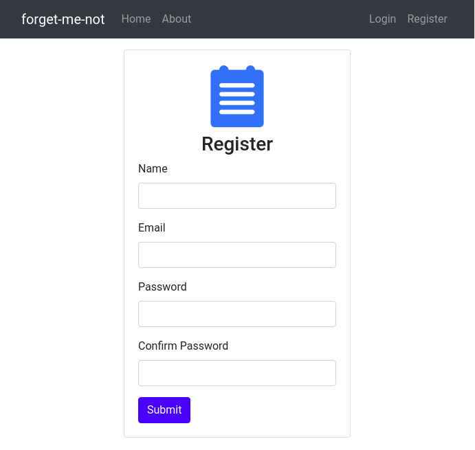

#  Full-stack app using Node.js & MongoDB for persistence

## [Live demo (on heroku)](https://ancient-shelf-29938.herokuapp.com/)

<p align="center"></p>

This note-taking app allows users to register and then login to create notes. A user can only edit and view their own notes.

All endpoints of the app are protected such that 'sensitive' routes (to view, add, edit notes) are only accessible to registerd & loggged in users, and it is not possible for a user to edit the note of another user (even if they somehow knew the edit URI for another user's note.)


&nbsp;
&nbsp;


## Installation

```bash
# Clone repository
$ git clone https://github.com/OmarHussainX/forget-me-not

# Enter project folder for a specific project, e.g.
$ cd forget-me-not

# Install dependencies
$ npm install

# Create a `.env` file in the root folder, and set environment variables:
PORT=5000
MONGO_URI=mongodb://path/to/your/db

# Start MongoDB service
$ sudo service mongod start

# Run project
$ npm run dev
```
